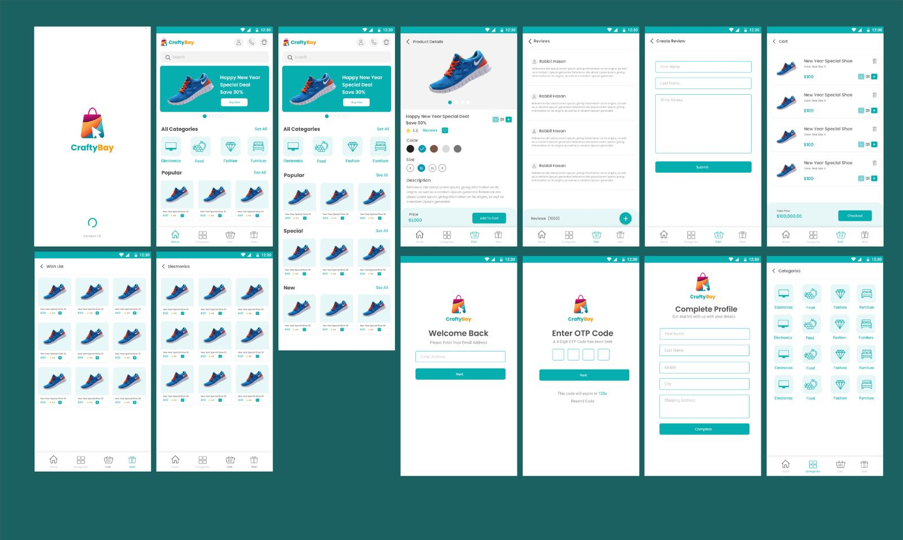

# 📱 Ecommerce App – Flutter

A modern ecommerce mobile application built with Flutter.  
It features secure authentication, product browsing, cart management, payment integration, localization, analytics, and a clean architecture using GetX.


## 🚀 Features

### 🛒 Core Ecommerce
- User login and registration  
- Product listing and category browsing  
- Product details with images  
- Add to cart and update cart  
- Checkout and payment processing  

### 🔐 Authentication
- Token-based login  
- SharedPreferences for session persistence  
- Auto-login on startup  

### 💳 Payment
- Integrated **SSLCommerz** for online payments  

### 📡 Networking
- Custom `NetworkCaller` for API communication  
- Centralized error handling with `NetworkResponse`  
- Token support for secure API calls  

### 🎨 UI & UX
- Responsive layout  
- Carousel slider  
- SVG support  
- SafeArea usage  
- Reusable widgets and a modular screen structure  

### 🧠 State Management
- Built using **GetX**  
- Controllers for each feature  
- Dependency Injection  
- Route management  
- Supports `GetBuilder` and `Obx`  

### ⚙️ Utilities
- App version with `package_info_plus`  
- Debug logger with `logger`  
- Local cache via SharedPreferences  

### 📊 Analytics & Stability
- Firebase Analytics  
- Firebase Crashlytics  

### 🌍 Localization
- Multi-language ready  
- Uses Flutter localization + intl package  

---

## 📦 Tech Stack

| Category | Technologies |
|---------|--------------|
| Framework | Flutter, Dart |
| State Management | GetX |
| Backend | REST API, HTTP |
| Firebase | Core, Analytics, Crashlytics |
| Local Storage | SharedPreferences |
| Payment | SSLCommerz |
| UI Tools | Carousel Slider, Flutter SVG |
| Utility | Intl, Logger, Package Info Plus |

---

## 📸 Screenshots


## ⚙️ How to Run
```
1. Clone the repository
  git clone https://github.com/arnob444/ecommerce_app.git
   
2. Go to the project directory
     cd todo_list

3. Install dependencies
     flutter pub get

4. Run the app
     flutter run

 ```

## 📦 Dependencies

**Core Flutter Packages**
- `flutter_localizations`  
- `cupertino_icons`  

**State Management**
- `get` (GetX)  

**Networking**
- `http`  

**Firebase**
- `firebase_core`  
- `firebase_analytics`  
- `firebase_crashlytics`  

**UI & UX**
- `flutter_svg`  
- `carousel_slider`  
- `pin_code_fields`  

**Storage & Utilities**
- `shared_preferences`  
- `package_info_plus`  
- `logger`  

**Payment**
- `flutter_sslcommerz`  

**Localization**
- `intl`  


## 🛠 Future Enhancements

Wishlist feature

Order history

Push notifications

Payment confirmation UI

Dark mode